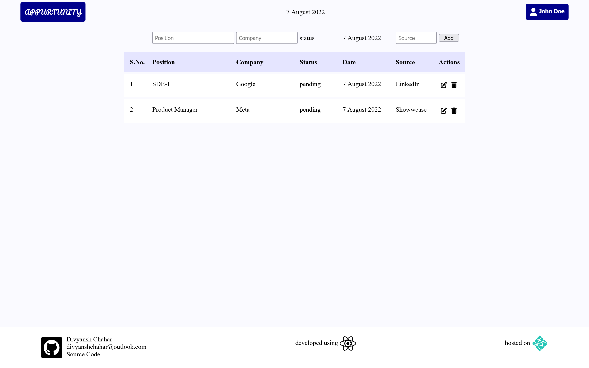

# JOB TRACKING APP

---

## About Project

This project was developed by the developer with the sole purpose of practicing react as is developer's first react project

## Current Functionality

- The user can add the following information:
  - Job title
  - Company
  - source (source of job posting)
- User can also delete entries
- Date of the job posting is recorded automatically

## Future Scope

- Edit status of already posted jobs
- Responsive UI

## How to install the app

This app was bootstrapped using react.
 
To install dependencies run

`npm install`

in the directory
